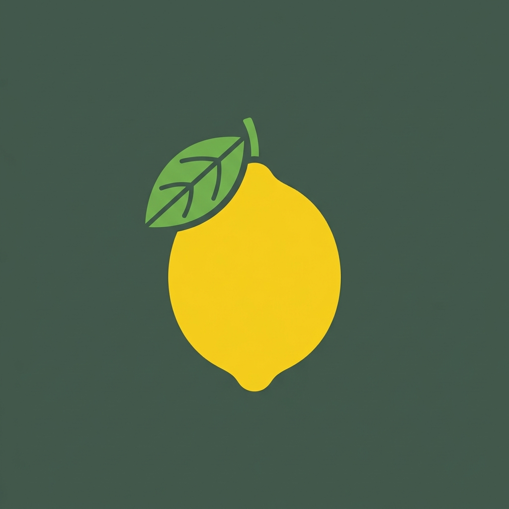
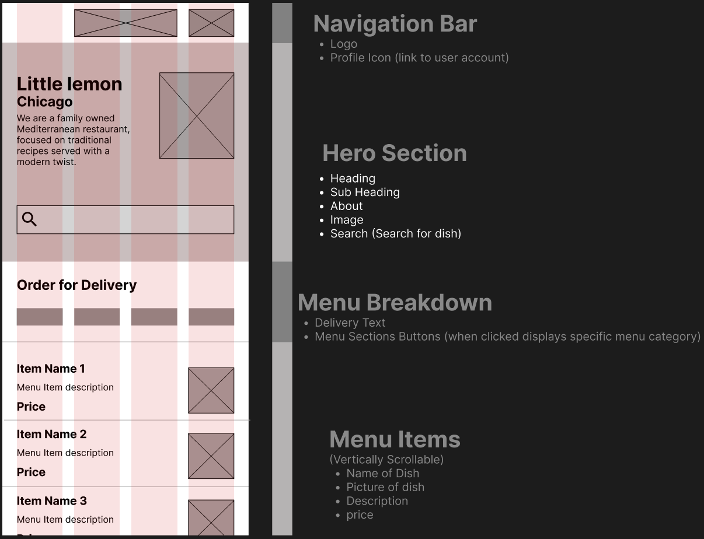
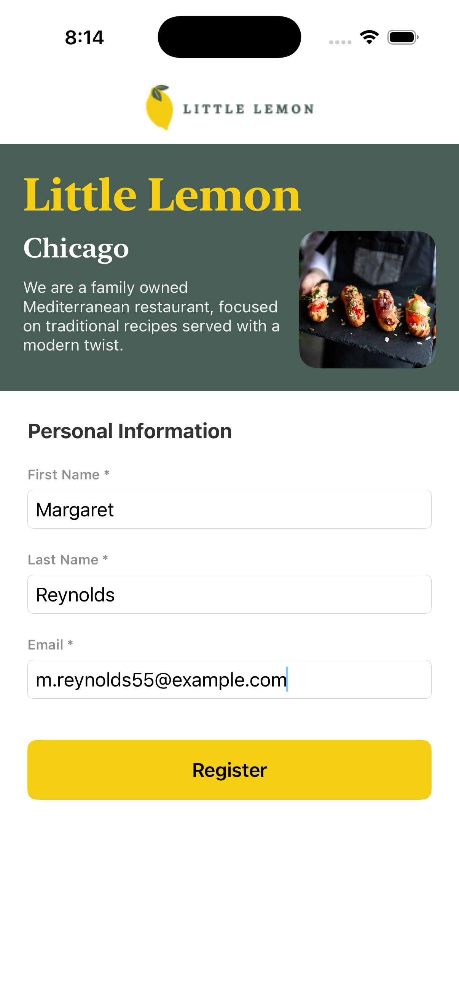
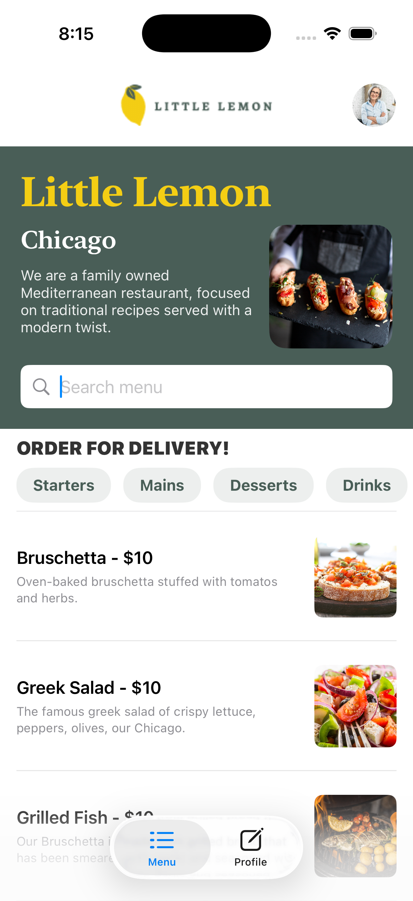
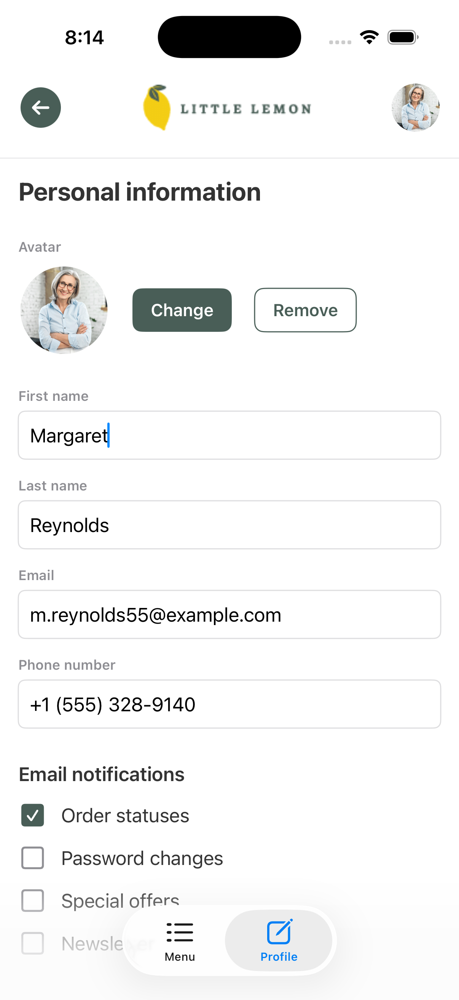
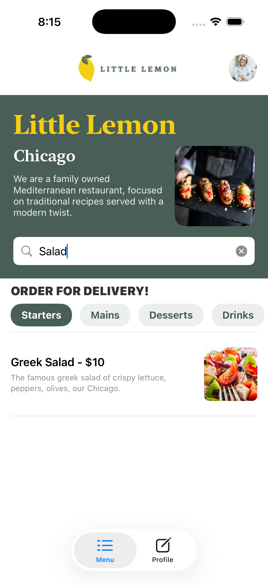

# 🍋 Little Lemon - iOS Capstone App

<p align="center">
  
</p>

Welcome to **Little Lemon**, a premium iOS application developed as the final Capstone Project for the **Meta iOS Developer Professional Certificate**. 

This app is built for a Mediterranean restaurant, featuring a dynamic food menu fetched from a remote server, Core Data persistence, custom image caching, real-time input validation, and user profile management.

---

## 🖼️ Wireframes & App Flow

The application was designed and built from initial wireframes to actual working code. Here is the visual progression of the app:

### 📐 Wireframes & Layout Design
Early design wireframes outlining the user flow and structure:


---

### 🚀 Onboarding Screen
A clean registration screen implementing real-time validation and persistent local login states:
<p align="center">
  
</p>

---

### 🍽️ Home & Menu Screen
The primary landing screen displaying restaurant dishes fetched from the API with clean custom styling:
<p align="center">
  
</p>

---

### 👤 User Profile Screen
A detailed profile settings card with interactive preferences, customizable avatar image picker, and local file storage persistence:
<p align="center">
  
</p>

---

### 🔍 Menu Filtering & Searching
Dynamic search matching and active category filters (Starters, Mains, Desserts, Drinks) acting instantly on the Core Data store:
<p align="center">
  
</p>

---

## 🛠️ Tech Stack

* **Language:** Swift 5.10
* **UI Framework:** SwiftUI
* **Database & Persistence:** Core Data (with SQLite back-end) & `UserDefaults`
* **Networking:** `URLSession` utilizing `Codable` for JSON parsing
* **Image Management:** Custom `NSCache`-backed caching (`CachedAsyncImage`) to minimize network request overhead
* **Validation:** Regular Expressions & `NSPredicate`
* **Architecture:** MVVM (Model-View-ViewModel)

---

## ⚙️ Technical Specifications & Implemented Features

### 1. Onboarding & Registration Page Setup 🚀
* **Root Navigation:** Set `OnboardingView` as the root view in `LemonCapstoneApp.swift` to handle incoming users.
* **Global Keys:** Created constants `kFirstName`, `kLastName`, `kEmail`, and `kIsLoggedIn` for robust keys referencing.
* **Form & Validation Logic:**
  * Real-time text field binding for first name, last name, and email.
  * Checks that no text fields are empty.
  * Verifies email formatting against standard pattern regex via `NSPredicate`.
  * Persists session status (`isLoggedIn = true`) to `UserDefaults` on successful registration, immediately routing the user to the `Home` view.
  * Adds an `onAppear` lifecycle check to skip the onboarding flow for users who are already logged in.
* **Styling:** Leveraged official brand colors: Primary Green (`#495E57`) for headers/hero sections, Primary Yellow (`#F4CE14`) for action buttons, and Charcoal (`#333333`) for high-contrast typography.

### 2. Programmatic Navigation & TabView Setup 🗺️
* **Navigation Flow:** Implemented programmatic routing in `OnboardingView` using a `NavigationLink` bound to the `$isLoggedIn` state.
* **Home Structure:** Created `HomeView.swift` which houses a Selection-bound `TabView` with two tabs:
  * **Menu** (index `0`, system image `"list.dash"`)
  * **UserProfile** (index `1`, system image `"square.and.pencil"`)
* **Back Button Control:** Disabled the native navigation bar back button to ensure a clean, modern user experience.

### 3. User Profile Setup, Redesign & Avatar Persistence 👤
* **Circular Avatar:** Designed a reusable `AvatarView` that renders custom UIImages in a filled circle, falling back to a placeholder asset if no custom avatar is set.
* **Interactive Profile Form:** Includes editable text fields for first name, last name, email, phone number, and toggles for email notification categories (Order Status, Password Changes, Special Offers, Newsletter).
* **Avatar File Persistence:** Custom profile pictures selected via the system `ImagePicker` are saved locally in the App Documents directory as JPEGs. The path is saved under `kAvatarPath` so it persists between app launches.
* **Input Cleaning:** Applied real-time filters using `.onChange` to restrict phone number inputs strictly to digits and standard phone symbols (`0-9`, `-`, `(`, `)`, `+`).
* **Visual Validation Feedback:** Direct, inline feedback shown via red alert messages for validation issues.

### 4. Menu Fetching, Persistence & Image Caching 💾
* **Decodable Entities:** Created `MenuItem` and `MenuList` payloads mapping to database entities.
* **Core Data Integration:** Swapped default models for `ExampleDatabase.xcdatamodeld` defining the `Dish` entity (`title`, `image`, `price`, `dishDescription`, `category`). 
* **Fetch Management:** Fetches restaurant data asynchronously from a remote endpoint using `URLSession`. It parses JSON on the main thread and writes new dishes to Core Data.
* **Duplicate Prevention:** Before triggering a network request, checks if dishes are already present in the database to avoid redundant queries.
* **Network & Image Optimization:** Implemented `CachedAsyncImage` powered by a static `NSCache` instance, downloading remote food images once and serving them instantly from memory on future requests.
* **Local Fallbacks:** Configured local asset fallbacks (`lemon-dessert` and `grilled-fish`) to guarantee correct display regardless of external asset server availability.

### 5. Sorting & Filtering the Food Menu 🔍
* **Core Data Predicates & Sorting:**
  * Implemented `buildSortDescriptors()` to sort dishes alphabetically using standard localized compare.
  * Formulated compound predicates in `buildPredicate()` combining search bar texts (`title CONTAINS[cd] %@`) and selected category chips (`category == %@`).
* **Dynamic Category Chips:** Custom category buttons (Starters, Mains, Desserts, Drinks) toggle active filters dynamically. Selected buttons display in high-contrast inverted colors.
* **Hero Search Integration:** Interactive search bar embedded directly inside the hero backdrop to enable instant list updates.

---

## 📂 File Structure

The project has been refactored into a clean MVVM structure:

```text
LemonCapstone/
├── App/
│   ├── LemonCapstoneApp.swift
│   └── Assets.xcassets (moved)
├── Core/
│   ├── Persistence.swift
│   ├── FetchedObjects.swift
│   ├── Constants.swift (NEW - contains shared UserDefaultsKeys)
│   └── Components/
│       └── AvatarView.swift
└── Features/
    ├── Onboarding/
    │   ├── Views/
    │   │   └── OnboardingView.swift (renamed from Onboarding.swift)
    │   └── ViewModels/
    │       └── OnboardingViewModel.swift (NEW)
    ├── Menu/
    │   ├── Views/
    │   │   ├── MenuView.swift (renamed from Menu.swift)
    │   │   ├── CategoryButton.swift (NEW - extracted helper view)
    │   │   └── CachedAsyncImage.swift (NEW - extracted helper view/cache)
    │   ├── ViewModels/
    │   │   └── MenuViewModel.swift (NEW)
    │   └── Models/
    │       ├── MenuItem.swift
    │       └── MenuList.swift
    ├── UserProfile/
    │   ├── Views/
    │   │   ├── UserProfileView.swift (renamed from UserProfile.swift)
    │   │   ├── CustomTextField.swift (NEW - extracted helper view)
    │   │   ├── ToggleItem.swift (NEW - extracted helper view)
    │   │   └── ImagePicker.swift (NEW - extracted UIViewControllerRepresentable)
    │   └── ViewModels/
    │       └── UserProfileViewModel.swift (NEW)
    └── Home/
        └── Views/
            └── HomeView.swift (renamed from Home.swift)
```

---

## 🚀 How to Run the App

Follow these steps to build and run the app locally:

### Prerequisites
* A Mac running macOS Sonoma or later.
* **Xcode 15** or later installed.
* An active Simulator or physical iOS device running **iOS 17.0** or later.

### Build and Launch Steps
1. Clone or download the repository to your local machine.
2. Open **Xcode**.
3. Go to `File > Open...` and select the **`LemonCapstone.xcodeproj`** file located in the root of the project.
4. Let Xcode index the files and load the Core Data models.
5. In the Scheme menu in Xcode (top toolbar), select the **`LemonCapstone`** target.
6. Choose a target device/simulator (e.g., **iPhone 17** simulator).
7. Build and run by pressing **`⌘ + R`** (or clicking the **Play** button in the top left).
8. The app will build and boot up in your selected Simulator!

*Note: Code signing is pre-configured to allow local Simulator compilation without needing a developer account.*
